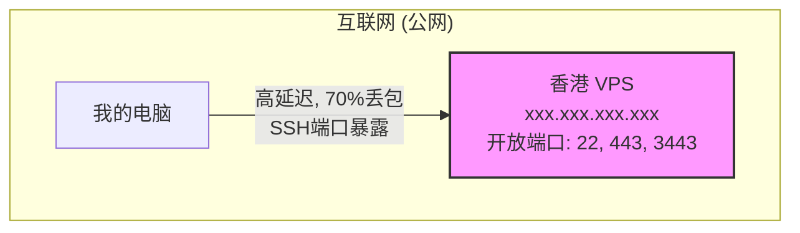
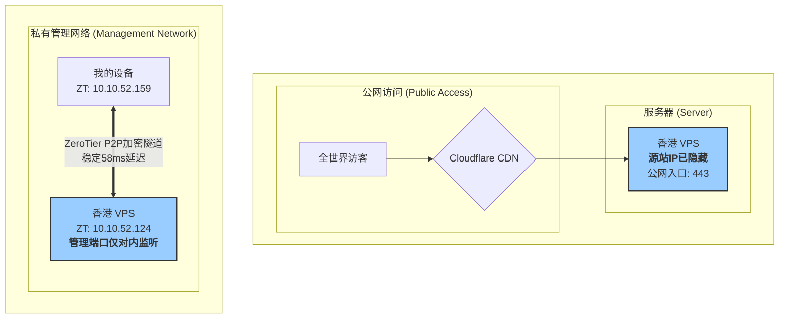

最近抽了点时间，准备把个人博客 `miceworld.top` 和一些自托管服务迁移到一台新的香港云服务器上。想着能有更完全的控制权，也方便自己折腾。

服务器的初始化很顺利，Debian 系统，Nginx + Hexo 部署网站，再用 Certbot 跑一下，HTTPS 的小绿锁很快就亮起来了。一切都按部就班。

<!-- more -->

麻烦是在日常管理时出现的。

当我准备通过 SSH 或者 Web 面板管理服务器时，发现直连的延迟非常高，终端的卡顿已经到了影响工作的程度。

起初，我尝试通过本地的代理软件（sing-box）来优化。为服务器 IP 单独设置直连规则，可以解决 Web 面板的访问问题；再为 SSH 的 22 端口设置一个出口选择器，也能在一定程度上缓解终端的卡顿。虽然能用，但总觉得不够优雅，而且每次 SSH 都需要手动选择节点，还是有些繁琐。

更重要的是，我内心对安全有种执念。把 SSH 端口直接暴露在公网上，哪怕用了密钥登录，也总让我感觉不踏实。毕竟，服务本身存在，就意味着存在被扫描和被未知漏洞攻击的风险。我的网站既然用了 Cloudflare 保护，源站 IP 就必须隐藏，端口也必须隔离，这才是完整的安全保障。

于是，我决定采用我过去习惯的一套方案，来从根本上解决这个问题。

### 第一次尝试：自建 ZeroTier Planet

我之前的经验是，通过自建 ZeroTier Planet，可以让所有设备脱离官方服务器，进行点对点的内网通信，在国内服务器之间的效果非常好，延迟极低。

于是我熟练地使用 `xubiaolin/docker-zerotier-planet` 工具在服务器上部署了私有 Planet，并将配置文件分发到了我的电脑上。

然而，结果却不尽人意。

```shell
> tracepath xxx.xxx.xxx.xxx
# ... (路由绕行，延迟飙升) ...
> ping xxx.xxx.xxx.xxx
# ... (高达70%的丢包率和3-4秒的延迟) ...
```

`tracepath` 和 `ping` 的结果很明确地告诉我，这次的情况和国内不同。夜间大陆访问香港的国际出口线路质量非常糟糕，丢包和高延迟是常态。在这样恶劣的物理链路上，ZeroTier 很难建立起稳定的 P2P 连接。

看来，过去成功的经验，并不能简单地复制到新的网络环境中。

### 改变思路：Planet 不行，那就用 Moon

既然完全独立的 Planet 方案受限于物理线路，我转而尝试了更灵活的 Moon 方案。Moon 作为官方 Planet 的一个自定义补充节点，可以辅助设备进行寻址和中继，增加 P2P 打洞成功的概率。

我从服务器上提取了 `.moon` 配置文件，部署到本地客户端的 `moons.d` 目录下，然后重启了 ZeroTier 服务。

这一次，网络状况得到了质的改善。

```shell
> ping 10.10.52.124
--- 10.10.52.124 ping 统计 ---
已发送 19 个包， 已接收 19 个包, 0% packet loss, time 18031ms
rtt min/avg/max/mdev = 57.315/58.608/65.970/1.802 ms

> tracepath 10.10.52.124
 1?: [本地主机]                   PMTU 2800
 1:  10.10.52.124                                         58.757 毫秒 到达
 ...
```

**0%丢包，延迟稳定在 58 毫秒，一跳直达。**

这证明，在 Moon 节点的辅助下，ZeroTier 成功地为我找到了一条可以避开骨干网拥堵的 P2P 隧道。管理服务器所需要的稳定连接，现在有了。

### 最后一步：彻底“隐形”

有了可靠的内网通道，我终于可以开始实施我最初的目标——将管理端口从公网上彻底移除。

我登录了云厂商的防火墙（安全组）控制台，修改了访问策略：

- 删除了所有允许公网 (`0.0.0.0/0`) 访问服务器 TCP `22` 和 `3443` 端口的规则。
- 新增了一条规则，只允许来自我的 ZeroTier 子网 (`10.10.52.0/24`) 的 IP 地址访问这些端口。

至于这个操作在 OSI 模型里算哪一层？

> ZeroTier 本身是一个构建在 OSI 第三层（网络层）之上的、为用户提供第二层（数据链路层）服务的虚拟网络解决方案。它像一个虚拟的以太网交换机，将二层数据帧封装在 UDP 包里，通过三层网络进行传输。
> 而我在云防火墙上的操作，是一个在基础设施虚拟化层实现的、作用于网络层和传输层（基于 IP 和 TCP 端口）的访问控制，但其效果，近乎于物理隔离。

#### **图 1：改造前的“门户大开”架构**



#### **图 2：改造后的“零信任”安全架构**



最终，我的服务器实现了“内外分离”：博客网站通过 Cloudflare 面向公网提供服务，源站 IP 被完美隐藏；而所有的管理入口，都“沉入”了仅对我可见的 ZeroTier 虚拟内网中。

虽然过程有些波折，但最终还是用自己熟悉的方式，解决了一个不大不小的问题。记录一下。
